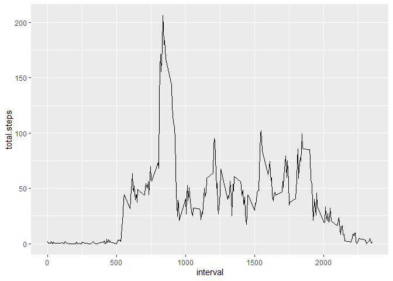

## Loading and preprocessing the data


```r
download.file("https://d396qusza40orc.cloudfront.net/repdata%2Fdata%2Factivity.zip", destfile = "activity.zip", mode="wb")

unzip("activity.zip")
data <- read.csv("activity.csv", header = TRUE)
head(data)
```

```
##   steps       date interval
## 1    NA 2012-10-01        0
## 2    NA 2012-10-01        5
## 3    NA 2012-10-01       10
## 4    NA 2012-10-01       15
## 5    NA 2012-10-01       20
## 6    NA 2012-10-01       25
```

## What is mean total number of steps taken per day?


```r
library(magrittr)
library(dplyr)
```

```
## 
## Attaching package: 'dplyr'
```

```
## The following objects are masked from 'package:stats':
## 
##     filter, lag
```

```
## The following objects are masked from 'package:base':
## 
##     intersect, setdiff, setequal, union
```

```r
data.by.date <- data %>%
  select(date, steps) %>%
  group_by(date) %>%
  summarize(total.steps = sum(steps)) %>%
  na.omit()
```

```
## `summarise()` ungrouping output (override with `.groups` argument)
```

```r
hist(data.by.date$total.steps, xlab = 'Total daily Steps', main = 'Total Steps By Day', breaks = 20)
```

<!-- -->

```r
mean(data.by.date$total.steps)
```

```
## [1] 10766.19
```

```r
median(data.by.date$total.steps)
```

```
## [1] 10765
```

## What is the average daily activity pattern?


```r
library(ggplot2)
data.by.interval <- data %>%
  select(interval, steps) %>%
  na.omit() %>%
  group_by(interval) %>%
  summarize(total.steps = mean(steps))
```

```
## `summarise()` ungrouping output (override with `.groups` argument)
```

```r
ggplot(data.by.interval, aes(x = interval, y = total.steps)) + geom_line()
```

<!-- -->
Interval with max number of steps

```r
data.by.interval[which(data.by.interval$total.steps == max(data.by.interval$total.steps)), ]
```

```
## # A tibble: 1 x 2
##   interval total.steps
##      <int>       <dbl>
## 1      835        206.
```

## Imputing missing values


```r
missing.values <- sum(is.na(data))
missing.values
```

```
## [1] 2304
```
NA values replaced with mean for 5-minute interval

```r
library(magrittr)
library(dplyr)

replacewithmean <- function(x) replace(x, is.na(x), mean(x, na.rm = TRUE))
mean.data <- data %>%
  group_by(interval) %>%
  mutate(steps= replacewithmean(steps))
```
Making Histogram and calculating new mean and median

```r
total.steps.filled <- tapply(mean.data$steps, mean.data$date, FUN=sum)

summary(total.steps.filled)
```

```
##    Min. 1st Qu.  Median    Mean 3rd Qu.    Max. 
##      41    9819   10766   10766   12811   21194
```

```r
qplot(total.steps.filled, binwidth = 1000, xlab = 'Total Steps Per Day')
```

<!-- -->

```r
mean(total.steps.filled)
```

```
## [1] 10766.19
```

```r
median(total.steps.filled)
```

```
## [1] 10766.19
```
Mean stayed the same, while median changed. Imputing missing data increased median estimate. This is because NA values, usually set to 0, are replaced with numbers greater than 0.

## Are there differences in activity patterns between weekdays and weekends?


```r
mean.data$date <- as.Date(mean.data$date)
mean.data$weekday <- weekdays(mean.data$date)
mean.data$weekend <- ifelse(mean.data$weekday == "Saturday" | mean.data$weekday == "Sunday", "Weekend", "Weekday" )

library(ggplot2)
mean.data.weekend.weekday <- aggregate(mean.data$steps , by = list(mean.data$weekend, mean.data$interval), na.omit(mean))
names(mean.data.weekend.weekday) <- c("weekend", "interval", "steps")

ggplot(mean.data.weekend.weekday, aes(x = interval, y = steps, color = weekend)) + geom_line() + facet_grid(weekend ~.) + xlab("Interval") + ylab("Mean Steps") + ggtitle("Comparison of Average Number of Steps in Each Interval")
```

<!-- -->
